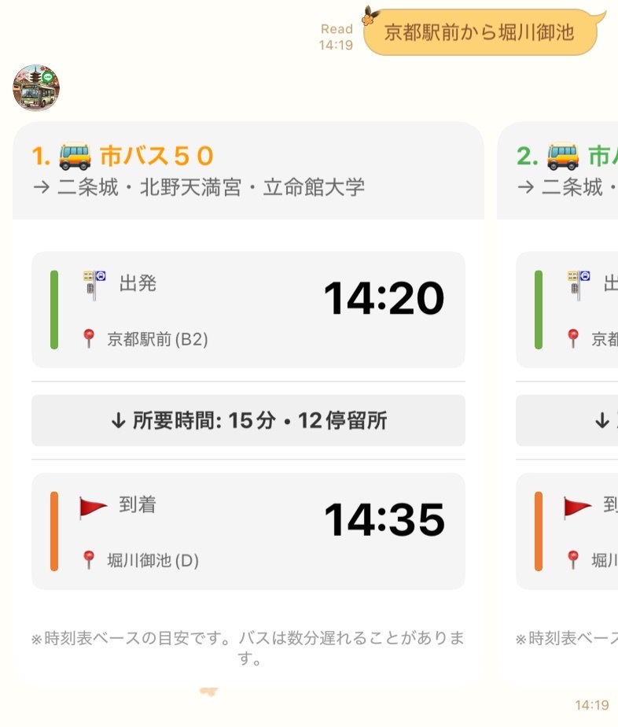
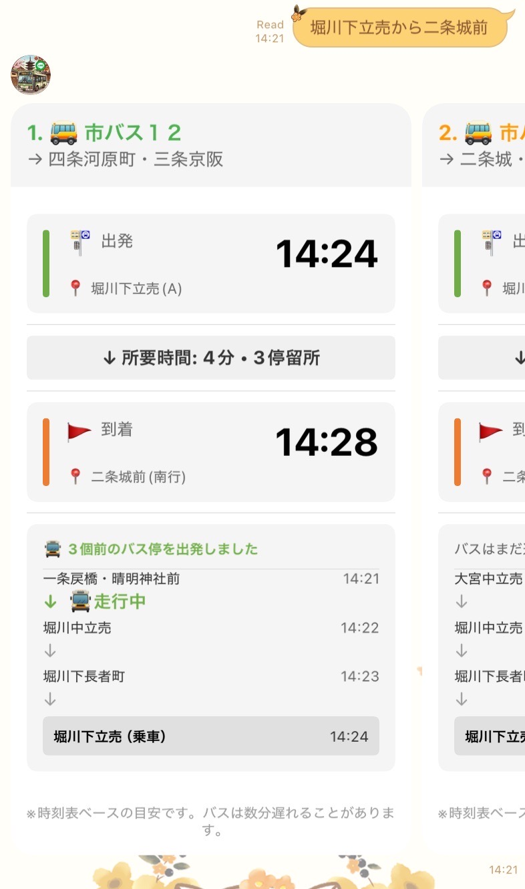
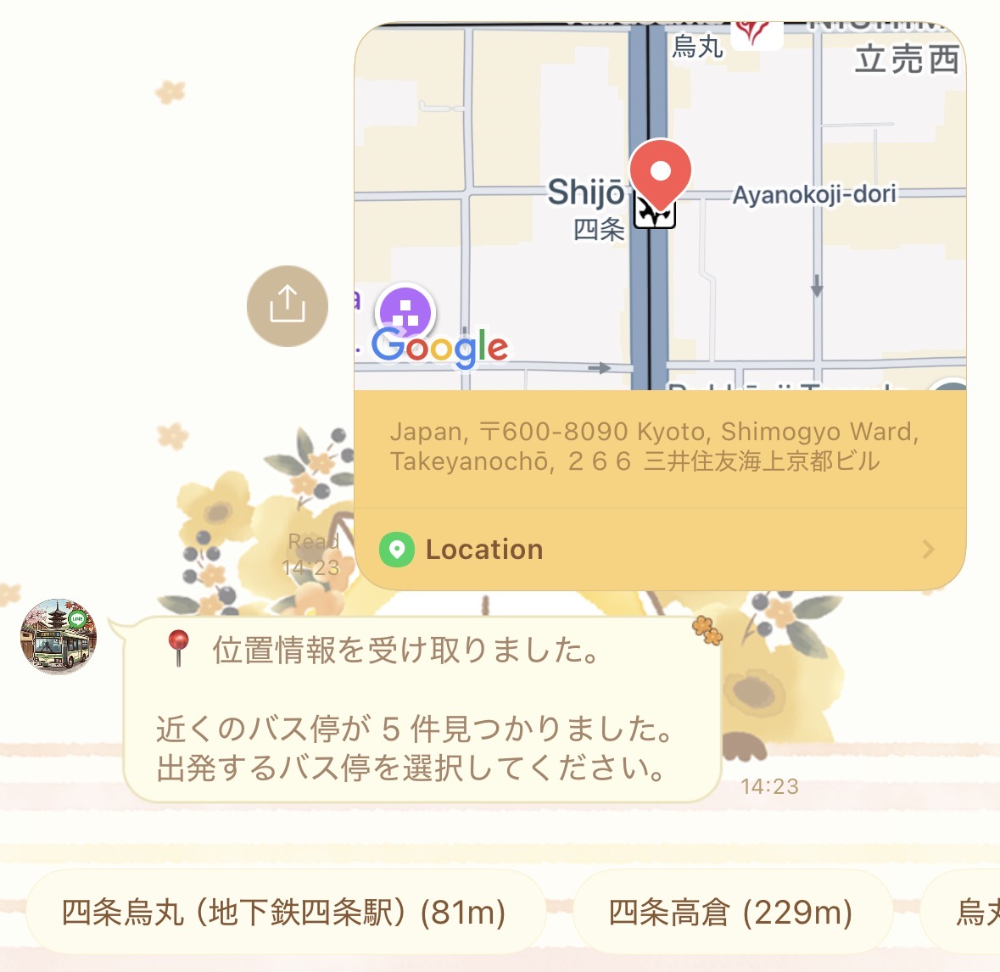
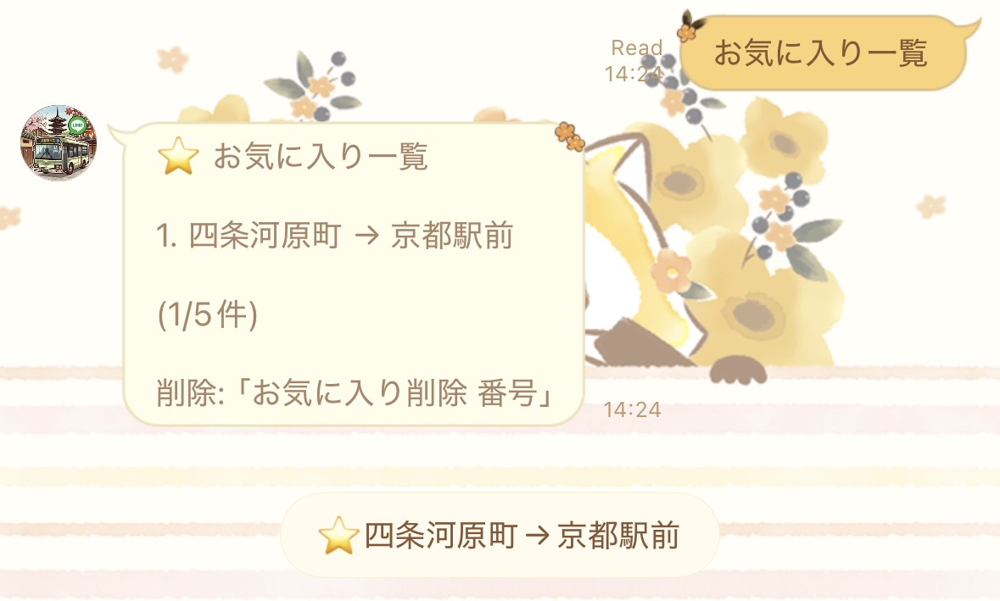
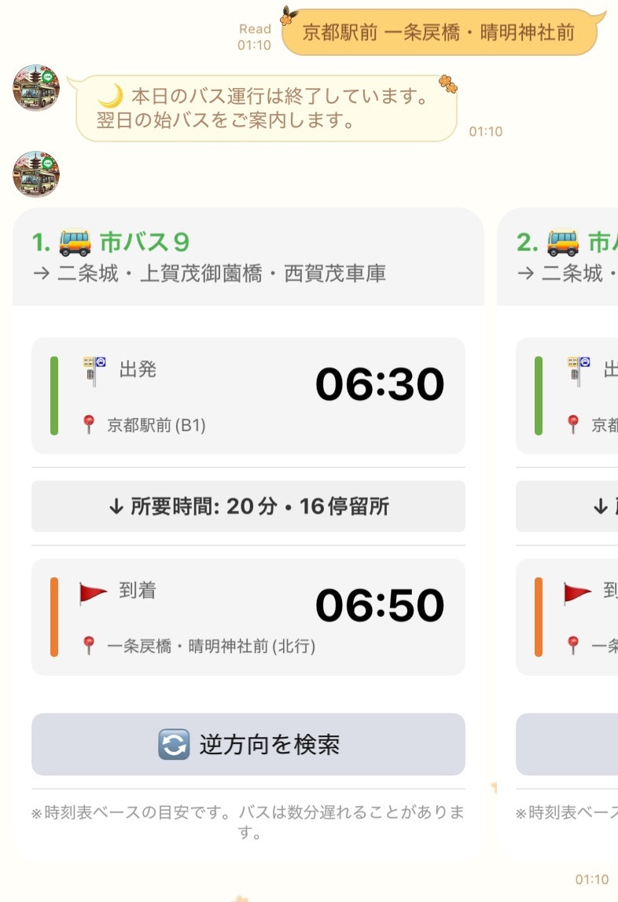
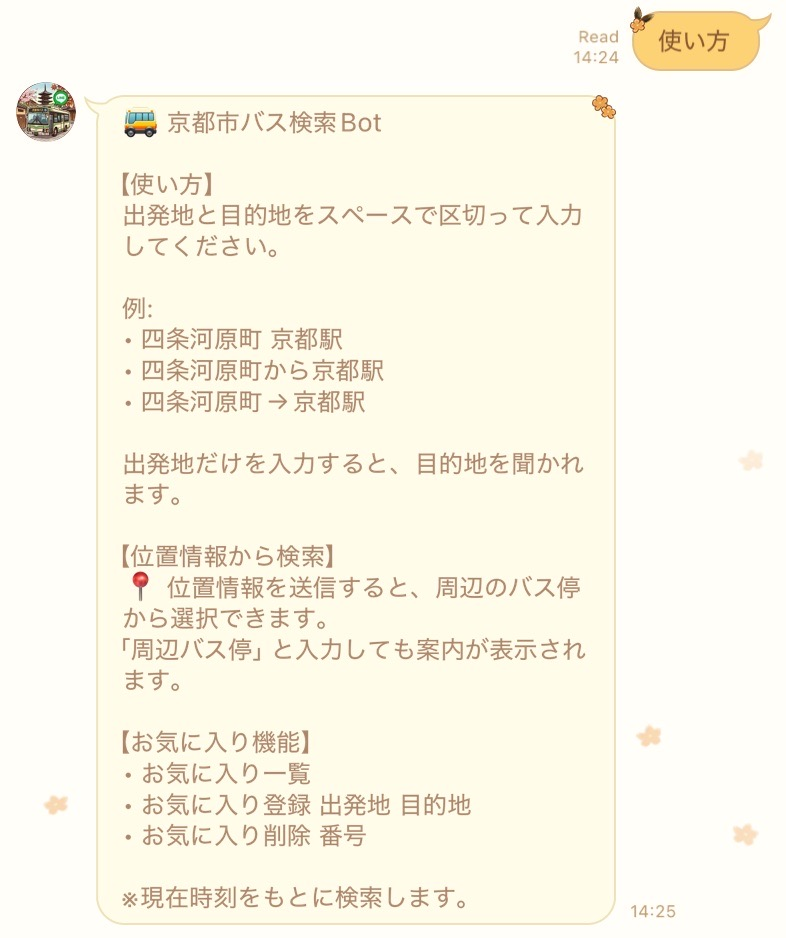

# 🚌 京都市バス検索 LINE Bot

出発地と目的地を入力するだけで、京都市バスのルート・時刻・リアルタイム情報を検索できる LINE Bot です 🔍

## 📱 友だち追加

QR コードを LINE で読み取って、今すぐ使ってみましょう！


<a href="https://lin.ee/pysroWR"></a>

## ✨ 機能紹介

### 🔎 バス路線検索

出発地と目的地のバス停名を送信すると、利用可能なバス路線を検索します。路線番号ごとに色分けされたカードで、出発時刻・到着時刻・所要時間・停車数がひと目で分かります 🎨



### 📡 リアルタイム情報

検索結果にバスの現在位置をリアルタイムで表示！「🚍 停車中」「🚍 走行中」などのステータスと、あと何停留所で到着するかを確認できます。



### 📍 位置情報から検索

LINE の位置情報を送信すると、周辺 500m 以内のバス停を自動で検索。表示されたバス停をタップするだけで、そこからの路線検索を開始できます 🗺️



### ⭐ お気に入り機能

よく使うルートをお気に入りに登録すると（最大5件）、ワンタップですぐに検索できます！



### 🌙 深夜の検索

夜遅い時間に検索した場合、翌日の始発バスを自動で案内します。



### ❓ ヘルプ・その他

「ヘルプ」と送信すると、使い方の一覧を確認できます。



## 💬 使い方

### ⌨️ テキストで検索

出発地と目的地をスペースで区切って送信します。

```
四条河原町 京都駅前
四条河原町から京都駅前
四条河原町→京都駅前
```

出発地だけを送信すると、目的地を聞かれます。

```
四条河原町
```

### 📍 位置情報で検索

1. LINE の「＋」ボタンから「位置情報」を送信
2. 表示された周辺バス停から出発地を選択
3. 目的地を入力

### ⭐ お気に入り

| コマンド | 説明 |
|---|---|
| `お気に入り一覧` | 登録済みのルートを表示 |
| `お気に入り登録 出発地 目的地` | ルートを登録 |
| `お気に入り削除 番号` | 番号を指定して削除 |

## ⚠️ 対応エリア・注意事項

- 🏙️ 京都市バスの路線が検索対象です
- 🕐 表示される時刻は時刻表に基づく推定です（GPS による追跡ではありません）
- 📅 平日・土曜・日曜祝日のダイヤを自動で判別します

## 📋 公共交通オープンデータについて

本 bot が利用する公共交通データは、[公共交通オープンデータセンター](https://ckan.odpt.org/)において提供されるものです。

公共交通事業者により提供されたデータを元にしていますが、必ずしも正確・完全なものとは限りません。

本 bot の表示内容について、公共交通事業者への直接のお問い合わせはご遠慮ください。

## 📮 お問い合わせ

本 bot に関するお問い合わせ: kmhcna@kmchan.jp

## 🔧 開発者向け

セットアップ・デプロイ手順については [docs/deployment.md](docs/deployment.md) を参照してください。
